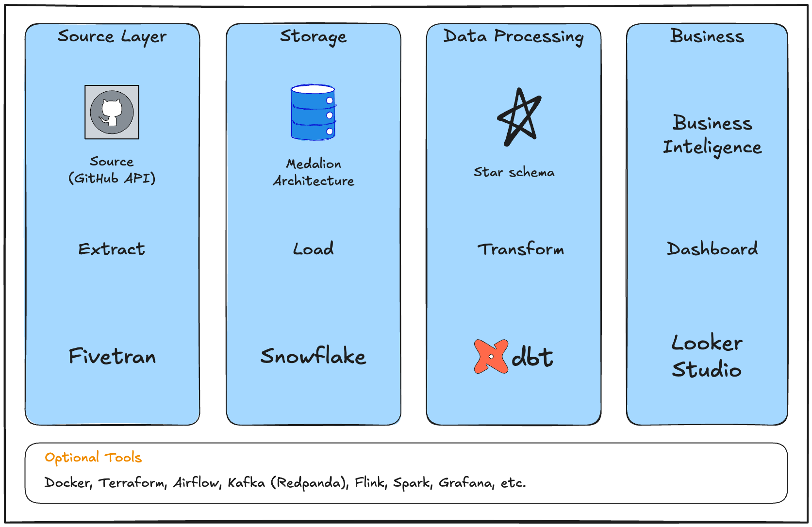

# Phase 1
- [x] Build MVP with a contraint of $0 cost
- [x] Keep it production-grade
- [x] Implement Star schema

# Phase 2

- [ ] Add Data Quality Tests (dbt)
- [ ] Add Documentation
- [ ] Implement SCD Type 2
- [ ] ADD CI/CD (Github Actions)
- [ ] Add IaC (Terraform)
- [ ] Add Orchestration (Airflow)
- [ ] Monitoring Costs (Grafana)
- [ ] Add more data sources

# Data Architect

1. Source: [Git API](https://docs.github.com/en/rest?apiVersion=2026-03-10)
2. Ingestion: Fivetran
3. Storage: Snowflake
4. Transformation: dbt Cloud
5. BI: Looker Studio



## Star schema

### Fact table
- `fct_repo_activity`: Stores daily counts of commits, PRs, and issues for each repository

### Dimension table
- `dim_repositories`: Stores details about each repository e.g., name, language, owner, and description.
- `dim_users`: Stores user information, e.g., username, name, and profile details.
- `dim_dates`: Stores date-related details, e.g., the date, month, quarter, and year.

## Output
- This project will focus more on the process of data engineer developing a reliable data pipleline and data infrastructure that will serve to DA/DS. 
- Constraint: $0 cost. This project will rely on free and trial products.
- Result: A working product that demonstrate my data engineering skills.
- Business questions (BI)

1. Which programming languages are most popular?
```sql
SELECT
    language,
    COUNT(*)        AS repo_count,
    SUM(stars)      AS total_stars,
    ROUND(AVG(stars), 1) AS avg_stars
FROM GITHUB_ANALYTICS.MARTS.DIM_REPOSITORIES
WHERE language IS NOT NULL
GROUP BY language
ORDER BY repo_count DESC;
```
2. What is the count of commit over time?
```sql
SELECT
    author_name,
    DATE_TRUNC('day', committed_at) AS commit_date,
    COUNT(*) AS commit_count,
    COUNT(DISTINCT repository_id) AS repos_contributed_to
FROM GITHUB_ANALYTICS.MARTS.FCT_CONTRIBUTORS
WHERE author_name IS NOT NULL
GROUP BY author_name, commit_date
```
3. How fast are repositry growing?
```sql
SELECT
    stat_date,
    SUM(repo_count) AS repos_created,
    SUM(SUM(repo_count)) OVER (ORDER BY stat_date) AS cumulative_repos
FROM GITHUB_ANALYTICS.MARTS.FCT_DAILY_STATS
GROUP BY stat_date
ORDER BY stat_date;
```
4. Who are the most active contributors?
```sql
SELECT
    author_name,
    commit_count,
    repos_contributed_to
FROM GITHUB_ANALYTICS.MARTS.FCT_CONTRIBUTORS
ORDER BY commit_count DESC
LIMIT 20;
```
5. How many issues get closed vs stay open?
```sql
SELECT
    SUM(open_issues)   AS open_issues,
    SUM(closed_issues) AS closed_issues,
    ROUND(SUM(closed_issues) / SUM(total_issues) * 100, 1) AS closed_pct
FROM GITHUB_ANALYTICS.MARTS.FCT_ISSUES;
```


# Techstack Choices

## Data source
- Kafka (Redpanda)
- Pyflink

## Cloud
- GCP/GCS

## IaC
- Terraform

## Containerization
- Docker (Orbstack)

## Database
- Postgres
- NEON

## Transformation
- dbt-core
- Spark

## Orchestrator
- Airflow

## Dashboard
- Looker Studio

# Reference
- [Your First Data Engineering Project: Build an End-to-End Solution for Free with best tools by Dmitry Anoshin](https://blog.surfalytics.com/p/your-first-data-engineering-project)

# Disclaimer
If you want to follow the reference guide, please be aware that the guide might contain incorrect information at some part. For example, the extracted data and the column name are not matching. Therefore, follow the guide with caution and prepare to debug and solve unexpected problem. (Which is great anyways for practical learning experience!)