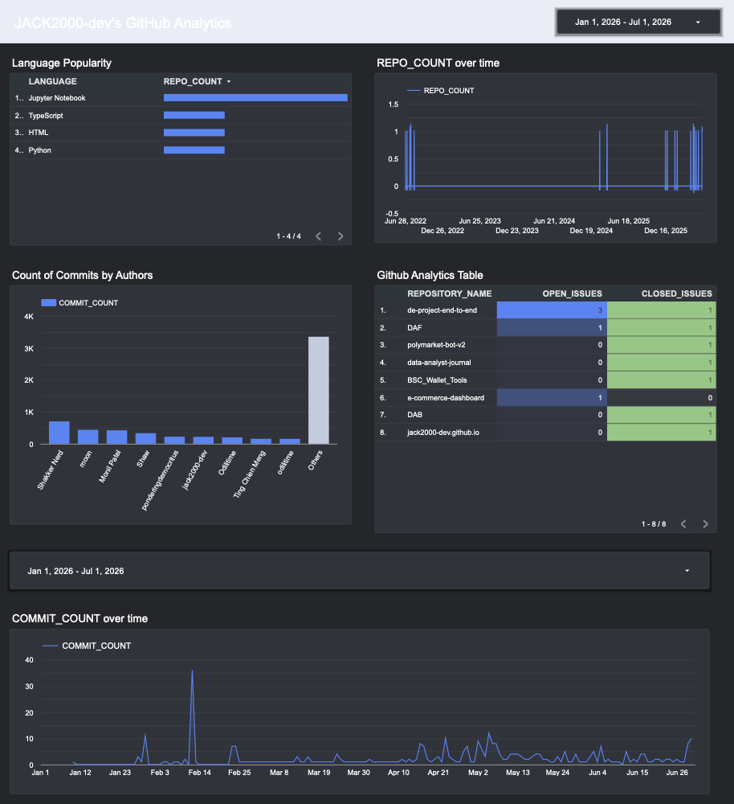
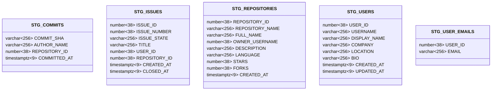
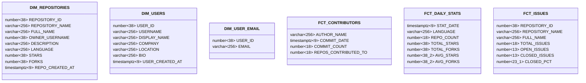

# Github Analytics
An end-to-end data engineering project to practice and demonstrate data engineering skills.

> [!NOTE] 
> This project is still work in progress and everything will slowly building up according to the PLAN.md
> The data is Extract, Load, and Transform (ELT) daily until the free trial ends.



[GITHUB LOOKER DASHBOARD](https://datastudio.google.com/reporting/5e8512da-48dd-4627-98c6-ea71e9fdbc75) - Dashboard refrest every 12 hours but the data from Snowflake, which is updated daily by Fivetran at 19:33 UTC and transform by dbt-Cloud's Jobs 1 hour after the data is loaded into Snowflake.

# How it works

1. Using Fivetran to Extract free data from Github API
2. Load into Snowflake data warehosue
3. Transform data using dbt Cloud and implementing Star Schema + Medalion Architecture
4. Utilize the data via Looker Studio to build dashboard with near-real-time data update


# Repository Structure

```text
├── LICENSE
├── NOTE.md
├── PLAN.md
├── README.md
├── img
│   ├── Github_Analytics.png
│   ├── data-engineer-project-design.png
│   └── fivetran_github_ERD.png
├── ingestion
├── snowflake
│   ├── db_structure.sql
│   ├── permisson.sql
│   └── test.ipynb
└── transform
    ├── analyses
    ├── dbt_project.yml
    ├── macros
    │   └── generate_schema_name.sql
    ├── models
    │   ├── marts
    │   │   ├── _marts.yml
    │   │   ├── dim_repositories.sql
    │   │   ├── dim_user_email.sql
    │   │   ├── dim_users.sql
    │   │   ├── fct_contributors.sql
    │   │   ├── fct_daily_stats.sql
    │   │   └── fct_issues.sql
    │   └── staging
    │       ├── _staging.yml
    │       ├── stg_commits.sql
    │       ├── stg_issues.sql
    │       ├── stg_repositories.sql
    │       ├── stg_user_emails.sql
    │       └── stg_users.sql
    ├── profiles.yml
    ├── seeds
    ├── snapshots
    └── tests
```
Note: If you want directory structure like this, use `tree` command. (I recommend to include `--gitignore` flag too)

# The Process

# Requirements

It's all start from requirement. In real world, it would be from client, business, stakeolder, or team. But in this project it come from PLAN.md. The requirement is to build a data pipeline that can extract data from Github API, load into Snowflake, transform the data using dbt Cloud, and visualize the data using Looker Studio. The project should be cost-effective and rely on free and trial products.

We can narrow down the data scope with "Business Questions" that we want to answer with the data. The business questions are:
1. Which programming languages are most popular?
2. What is the count of commit over time?
3. How fast are repositry growing?
4. Who are the most active contributors?
5. How many issues are opened and closed over time?

Note: I didn't answer these questions perfectly as I'm facing issue with `fork` column tamper the `commits` data. But that's the part of the learning process. We build things, it's went wrong, we fix it, and we learn from it. The important thing is to have a working product that demonstrate my data engineering skills.

# Data Model

1. Create the database structure in Snowflake using the `db_structure.sql` file in the `snowflake` directory. This will create the necessary databases, schemas, and tables for the project.
2. Provide the necessary permissions to the user using the `permission.sql` file in the `snowflake` directory. This will grant the user access to the databases, schemas, and tables created in the previous step.

Note: To extract Entity Relationship Diagram (ERD) from Snowflake, I used DataGrip to connect to Snowflake and generate the ERD diagram then export it to mermaid.

## Medallion Architecture

### GITHUB_RAW

```mermaid
classDiagram
direction BT
class BRANCH_COMMIT_RELATION {
   timestamptz~9~ _FIVETRAN_SYNCED
   varchar~256~ BRANCH_NAME
   varchar~256~ COMMIT_SHA
}
class COMMIT {
   number~38~ REPOSITORY_ID
   timestamptz~9~ AUTHOR_DATE
   varchar~256~ COMMITTER_EMAIL
   varchar~256~ COMMITTER_NAME
   timestamptz~9~ COMMITTER_DATE
   varchar~256~ AUTHOR_EMAIL
   varchar~256~ AUTHOR_NAME
   varchar~16384~ MESSAGE
   timestamptz~9~ _FIVETRAN_SYNCED
   varchar~256~ SHA
}
class COMMIT_CHECK_RUN {
   varchar~256~ EXTERNAL_ID
   varchar~256~ NAME
   varchar~256~ STATUS
   varchar~256~ CONCLUSION
   timestamptz~9~ STARTED_AT
   timestamptz~9~ COMPLETED_AT
   number~38~ CHECK_SUITE_ID
   number~38~ APP_ID
   varchar~256~ APP_NAME
   timestamptz~9~ _FIVETRAN_SYNCED
   varchar~256~ COMMIT_SHA
   number~38~ ID
}
class COMMIT_FILE {
   number~38~ ADDITIONS
   number~38~ DELETIONS
   number~38~ CHANGES
   varchar~256~ STATUS
   timestamptz~9~ _FIVETRAN_SYNCED
   varchar~256~ COMMIT_SHA
   varchar~256~ FILENAME
}
class COMMIT_PARENT {
   timestamptz~9~ _FIVETRAN_SYNCED
   varchar~256~ COMMIT_SHA
   varchar~256~ PARENT_SHA
}
class COMMIT_PULL_REQUEST {
   timestamptz~9~ _FIVETRAN_SYNCED
   varchar~256~ COMMIT_SHA
   number~38~ PULL_REQUEST_ID
}
class DEPLOYMENT {
   varchar~256~ COMMIT_SHA
   timestamptz~9~ CREATED_AT
   varchar~256~ DESCRIPTION
   varchar~256~ ENVIRONMENT
   varchar~256~ ORIGINAL_ENVIRONMENT
   variant PAYLOAD
   boolean PRODUCTION_ENVIRONMENT
   varchar~256~ REF
   varchar~256~ TASK
   boolean TRANSIENT_ENVIRONMENT
   timestamptz~9~ UPDATED_AT
   number~38~ CREATOR_ID
   boolean _FIVETRAN_DELETED
   timestamptz~9~ _FIVETRAN_SYNCED
   number~38~ ID
}
class DEPLOYMENT_STATUS {
   number~38~ DEPLOYMENT_ID
   timestamptz~9~ CREATED_AT
   varchar~256~ DESCRIPTION
   varchar~256~ ENVIRONMENT
   varchar~256~ STATE
   timestamptz~9~ UPDATED_AT
   number~38~ CREATOR_ID
   boolean _FIVETRAN_DELETED
   timestamptz~9~ _FIVETRAN_SYNCED
   number~38~ ID
}
class ISSUE {
   timestamptz~9~ CREATED_AT
   timestamptz~9~ UPDATED_AT
   number~38~ NUMBER
   varchar~256~ STATE
   varchar~256~ STATE_REASON
   varchar~256~ TITLE
   varchar~8192~ BODY
   boolean LOCKED
   timestamptz~9~ CLOSED_AT
   number~38~ REPOSITORY_ID
   number~38~ MILESTONE_ID
   boolean PULL_REQUEST
   number~38~ USER_ID
   timestamptz~9~ _FIVETRAN_SYNCED
   number~38~ ID
}
class ISSUE_ASSIGNEE {
   timestamptz~9~ _FIVETRAN_SYNCED
   number~38~ ISSUE_ID
   number~38~ USER_ID
}
class ISSUE_ASSIGNEE_HISTORY {
   boolean ASSIGNED
   number~38~ ASSIGNER_ID
   timestamptz~9~ _FIVETRAN_SYNCED
   number~38~ ISSUE_ID
   timestamptz~9~ UPDATED_AT
   number~38~ USER_ID
}
class ISSUE_CLOSED_HISTORY {
   number~38~ ACTOR_ID
   varchar~256~ COMMIT_SHA
   timestamptz~9~ _FIVETRAN_SYNCED
   boolean CLOSED
   number~38~ ISSUE_ID
   timestamptz~9~ UPDATED_AT
}
class ISSUE_COMMENT {
   number~38~ ISSUE_ID
   varchar~1024~ BODY
   timestamptz~9~ CREATED_AT
   timestamptz~9~ UPDATED_AT
   number~38~ USER_ID
   timestamptz~9~ _FIVETRAN_SYNCED
   number~38~ ID
}
class ISSUE_LABEL {
   varchar~256~ LABEL
   timestamptz~9~ _FIVETRAN_SYNCED
   number~38~ ISSUE_ID
   number~38~ LABEL_ID
}
class ISSUE_LABEL_HISTORY {
   boolean LABELED
   number~38~ ACTOR_ID
   timestamptz~9~ _FIVETRAN_SYNCED
   number~38~ ISSUE_ID
   number~38~ LABEL_ID
   timestamptz~9~ UPDATED_AT
}
class ISSUE_MERGED {
   number~38~ ACTOR_ID
   timestamptz~9~ _FIVETRAN_SYNCED
   varchar~256~ COMMIT_SHA
   number~38~ ISSUE_ID
   timestamptz~9~ MERGED_AT
}
class LABEL {
   varchar~256~ NAME
   varchar~256~ URL
   varchar~256~ COLOR
   varchar~256~ DESCRIPTION
   boolean IS_DEFAULT
   timestamptz~9~ _FIVETRAN_SYNCED
   number~38~ ID
}
class PAGE_VIEW {
   number~38~ COUNT_VALUE
   number~38~ UNIQUES
   timestamptz~9~ _FIVETRAN_SYNCED
   number~38~ REPOSITORY_ID
   timestamptz~9~ TIMESTAMP_VALUE
}
class PULL_REQUEST {
   number~38~ ISSUE_ID
   varchar~256~ ACTIVE_LOCK_REASON
   timestamptz~9~ CREATED_AT
   timestamptz~9~ CLOSED_AT
   boolean DRAFT
   varchar~256~ MERGE_COMMIT_SHA
   timestamptz~9~ UPDATED_AT
   varchar~256~ HEAD_LABEL
   varchar~256~ HEAD_REF
   varchar~256~ HEAD_SHA
   number~38~ HEAD_REPO_ID
   number~38~ HEAD_USER_ID
   varchar~256~ BASE_LABEL
   varchar~256~ BASE_REF
   varchar~256~ BASE_SHA
   number~38~ BASE_REPO_ID
   number~38~ BASE_USER_ID
   timestamptz~9~ _FIVETRAN_SYNCED
   number~38~ ID
}
class PULL_REQUEST_REVIEW {
   number~38~ PULL_REQUEST_ID
   varchar~2048~ BODY
   timestamptz~9~ SUBMITTED_AT
   varchar~256~ STATE
   number~38~ USER_ID
   varchar~256~ COMMIT_SHA
   timestamptz~9~ _FIVETRAN_SYNCED
   number~38~ ID
}
class RELEASE {
   number~38~ REPOSITORY_ID
   varchar~1024~ BODY
   timestamptz~9~ CREATED_AT
   boolean DRAFT
   varchar~256~ NAME
   boolean PRERELEASE
   timestamptz~9~ PUBLISHED_AT
   varchar~256~ TAG_NAME
   varchar~256~ TARGET_COMMITISH
   timestamptz~9~ UPDATED_AT
   number~38~ AUTHOR_ID
   boolean _FIVETRAN_DELETED
   timestamptz~9~ _FIVETRAN_SYNCED
   number~38~ ID
}
class REPOSITORY {
   varchar~256~ NAME
   varchar~256~ FULL_NAME
   varchar~256~ DESCRIPTION
   boolean FORK
   boolean ARCHIVED
   varchar~256~ HOMEPAGE
   varchar~256~ LANGUAGE
   varchar~256~ DEFAULT_BRANCH
   timestamptz~9~ CREATED_AT
   number~38~ WATCHERS_COUNT
   number~38~ FORKS_COUNT
   number~38~ OWNER_ID
   boolean PRIVATE
   timestamptz~9~ _FIVETRAN_SYNCED
   number~38~ ID
}
class REPOSITORY_CLONE {
   number~38~ COUNT_VALUE
   number~38~ UNIQUES
   timestamptz~9~ _FIVETRAN_SYNCED
   number~38~ REPOSITORY_ID
   timestamptz~9~ TIMESTAMP_VALUE
}
class REPOSITORY_LANGUAGE {
   number~38~ BYTES
   timestamptz~9~ _FIVETRAN_SYNCED
   number~38~ REPOSITORY_ID
   varchar~256~ NAME
}
class REPOSITORY_TOPIC {
   timestamptz~9~ _FIVETRAN_SYNCED
   number~38~ REPOSITORY_ID
   varchar~256~ NAME
}
class REPO_COLLABORATOR {
   boolean SITE_ADMIN
   varchar~256~ ROLE_NAME
   boolean PULL
   boolean TRIAGE
   boolean PUSH
   boolean MAINTAIN
   boolean ADMIN
   boolean _FIVETRAN_DELETED
   timestamptz~9~ _FIVETRAN_SYNCED
   number~38~ REPOSITORY_ID
   number~38~ USER_ID
}
class USER {
   varchar~256~ LOGIN
   varchar~256~ TYPE
   boolean SITE_ADMIN
   varchar~256~ NAME
   varchar~256~ COMPANY
   varchar~256~ BLOG
   varchar~256~ LOCATION
   boolean HIREABLE
   varchar~256~ BIO
   timestamptz~9~ CREATED_AT
   timestamptz~9~ UPDATED_AT
   timestamptz~9~ _FIVETRAN_SYNCED
   number~38~ ID
}
class USER_EMAIL {
   number~38~ USER_ID
   varchar~256~ NAME
   timestamptz~9~ _FIVETRAN_SYNCED
   varchar~256~ EMAIL
}

BRANCH_COMMIT_RELATION  -->  COMMIT : COMMIT_SHA-SHA
COMMIT  -->  REPOSITORY : REPOSITORY_ID-ID
COMMIT  -->  USER_EMAIL : AUTHOR_EMAIL-EMAIL
COMMIT  -->  USER_EMAIL : COMMITTER_EMAIL-EMAIL
COMMIT_CHECK_RUN  -->  COMMIT : COMMIT_SHA-SHA
COMMIT_PARENT  -->  COMMIT : COMMIT_SHA-SHA
COMMIT_PARENT  -->  COMMIT : PARENT_SHA-SHA
COMMIT_PULL_REQUEST  -->  COMMIT : COMMIT_SHA-SHA
COMMIT_PULL_REQUEST  -->  PULL_REQUEST : PULL_REQUEST_ID-ID
DEPLOYMENT  -->  COMMIT : COMMIT_SHA-SHA
DEPLOYMENT  -->  USER : CREATOR_ID-ID
DEPLOYMENT_STATUS  -->  DEPLOYMENT : DEPLOYMENT_ID-ID
DEPLOYMENT_STATUS  -->  USER : CREATOR_ID-ID
ISSUE  -->  REPOSITORY : REPOSITORY_ID-ID
ISSUE  -->  USER : USER_ID-ID
ISSUE_ASSIGNEE  -->  ISSUE : ISSUE_ID-ID
ISSUE_ASSIGNEE  -->  USER : USER_ID-ID
ISSUE_ASSIGNEE_HISTORY  -->  ISSUE : ISSUE_ID-ID
ISSUE_ASSIGNEE_HISTORY  -->  USER : USER_ID-ID
ISSUE_ASSIGNEE_HISTORY  -->  USER : ASSIGNER_ID-ID
ISSUE_CLOSED_HISTORY  -->  COMMIT : COMMIT_SHA-SHA
ISSUE_CLOSED_HISTORY  -->  ISSUE : ISSUE_ID-ID
ISSUE_CLOSED_HISTORY  -->  USER : ACTOR_ID-ID
ISSUE_COMMENT  -->  ISSUE : ISSUE_ID-ID
ISSUE_COMMENT  -->  USER : USER_ID-ID
ISSUE_LABEL  -->  ISSUE : ISSUE_ID-ID
ISSUE_LABEL  -->  LABEL : LABEL_ID-ID
ISSUE_LABEL_HISTORY  -->  ISSUE : ISSUE_ID-ID
ISSUE_LABEL_HISTORY  -->  LABEL : LABEL_ID-ID
ISSUE_LABEL_HISTORY  -->  USER : ACTOR_ID-ID
ISSUE_MERGED  -->  COMMIT : COMMIT_SHA-SHA
ISSUE_MERGED  -->  ISSUE : ISSUE_ID-ID
ISSUE_MERGED  -->  USER : ACTOR_ID-ID
PAGE_VIEW  -->  REPOSITORY : REPOSITORY_ID-ID
PULL_REQUEST  -->  ISSUE : ISSUE_ID-ID
PULL_REQUEST  -->  REPOSITORY : HEAD_REPO_ID-ID
PULL_REQUEST  -->  REPOSITORY : BASE_REPO_ID-ID
PULL_REQUEST  -->  USER : HEAD_USER_ID-ID
PULL_REQUEST  -->  USER : BASE_USER_ID-ID
PULL_REQUEST_REVIEW  -->  COMMIT : COMMIT_SHA-SHA
PULL_REQUEST_REVIEW  -->  PULL_REQUEST : PULL_REQUEST_ID-ID
PULL_REQUEST_REVIEW  -->  USER : USER_ID-ID
RELEASE  -->  REPOSITORY : REPOSITORY_ID-ID
RELEASE  -->  USER : AUTHOR_ID-ID
REPOSITORY  -->  USER : OWNER_ID-ID
REPOSITORY_CLONE  -->  REPOSITORY : REPOSITORY_ID-ID
REPOSITORY_LANGUAGE  -->  REPOSITORY : REPOSITORY_ID-ID
REPOSITORY_TOPIC  -->  REPOSITORY : REPOSITORY_ID-ID
REPO_COLLABORATOR  -->  REPOSITORY : REPOSITORY_ID-ID
REPO_COLLABORATOR  -->  USER : USER_ID-ID
USER_EMAIL  -->  USER : USER_ID-ID

```



### GITHUB_STAGING



## Star Schema

Note: Actually, this is more like a Constellation Schema because the fact table is shared by multiple dimension tables.

### GITHUB_ANALYTICS



## dbt Setup

This project runs on [dbt Fusion](https://github.com/dbt-labs/dbt-fusion) (preview), dbt Labs' new engine — not classic dbt-core. A few commands below differ from what you may be used to.

### Prerequisites

- Install dbt Fusion: I install via [Homebrew](https://github.com/dbt-labs/homebrew-dbt-cli)
- Copy `.env.example` to your own `.env` and fill in your Snowflake credentials
- [direnv](https://direnv.net/) installed for local development (`transform/.envrc` auto-loads `.env` via `dotenv ../.env`)

### 1. Verify the connection

```
cd transform
dbt debug
```

### 2. Build the pipeline

Runs models and tests together, in dependency order:

```
dbt build
```

Or run the steps separately:

```
dbt run    # build models only
dbt test   # run tests only
```

### 3. Generate and view documentation

```
dbt compile --write-index
dbt docs serve
```
(On classic dbt-core, the equivalent is `dbt docs generate` + `dbt docs serve`.)

# How to run it

End-to-end order to stand up the whole pipeline from scratch. Steps that already have their own section just link there instead of repeating.

## 1. Ingestion (Fivetran)

- Create a free-tier [Fivetran](https://www.fivetran.com/) account.
- Add a **GitHub** connector as the source, authenticate via GitHub OAuth/PAT, and pick which repos to sync.
  - Careful: syncing a fork pulls the *entire* commit history of the original repo, not just your changes.
- Set the destination to the `GITHUB_RAW` Snowflake database.
  - Fivetran names the destination schema after the connector type (`GITHUB`) and locks it after the first save — it will ignore a custom schema name.
- Set the sync frequency (this project syncs daily at 19:33 UTC).

## 2. Warehouse setup (Snowflake)

Follow [Data Model](#data-model) above to create the databases/schemas (`db_structure.sql`) and grant permissions (`permission.sql`).

## 3. Transformation (dbt)

Follow [dbt Setup](#dbt-setup) above to build and test the staging + marts models.

- Schedule the dbt job to run *after* Fivetran's sync completes (this project runs dbt Cloud 1 hour after the 19:33 UTC Fivetran sync, as a simple time offset rather than event-triggered chaining).

## 4. Dashboard (Looker Studio)

- Connect Looker Studio to Snowflake and point it at the `GITHUB_ANALYTICS.MARTS` tables.
- Looker Studio does not auto-discover new tables — each new mart must be added once as its own data source; after that it refreshes automatically.
- Build charts against the [business questions](#requirements) above.

# License

© Copyright 2026 jack2000-dev 